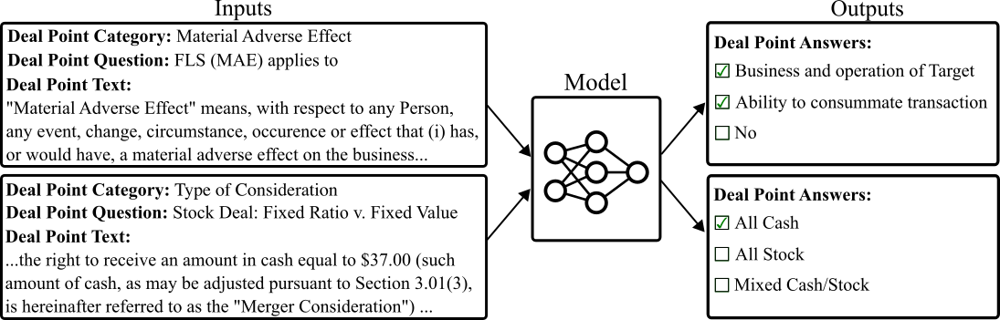

# Merger Agreement Understanding Dataset (MAUD)



[[Paper]](https://arxiv.org/abs/2301.00876)
[[Dataset]](https://drive.google.com/drive/folders/1RujOK2FZKdFSCJ15tqdyd42g8WLsYagj)

This repository contains code for the [Merger Agreement Understanding Dataset (MAUD)](https://www.atticusprojectai.org/maud), a dataset for merger agreement review curated by the Atticus Project and used in the 2021 American Bar Association Public Target Deal Points Study.


## Installation
First, install pytorch with GPU support for your distribution: https://pytorch.org/get-started/locally/

Then, run `pip install -e .`

Unzip the data files with `unzip data.zip`.

## Best Found Hyperparameters
Best found hyperparameters and corresponding validation scores, are available in the CSVs `best_found_hps/*.csv`.

## Training and Evaluation
Run `scripts/train.sh` and `scripts/train_multi.sh` to train models on best hyperparameters.
Run `scripts/evaluate.sh` to evaluate models afterwards.


## Citation
If you find MAUD useful in your research, please consider citing:
```
@misc{wang2023maud,
      title={MAUD: An Expert-Annotated Legal NLP Dataset for Merger Agreement Understanding}, 
      author={Steven H. Wang and Antoine Scardigli and Leonard Tang and Wei Chen and Dimitry Levkin and Anya Chen and Spencer Ball and Thomas Woodside and Oliver Zhang and Dan Hendrycks},
      year={2023},
      eprint={2301.00876},
      archivePrefix={arXiv},
      primaryClass={cs.CL}
}
```
